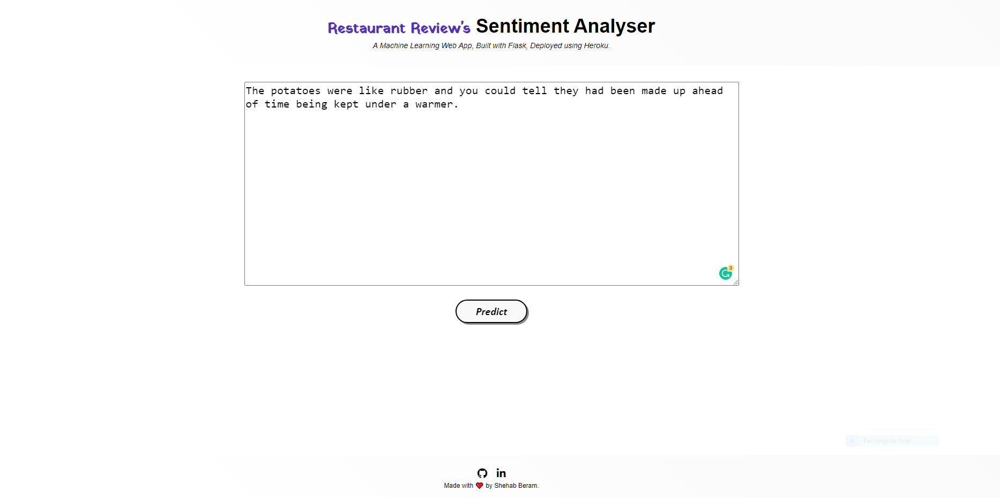
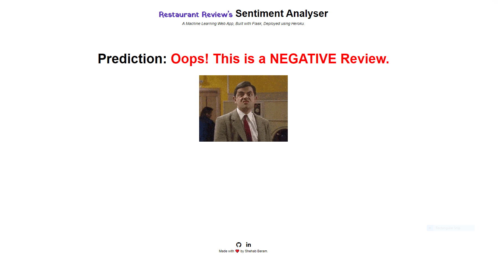
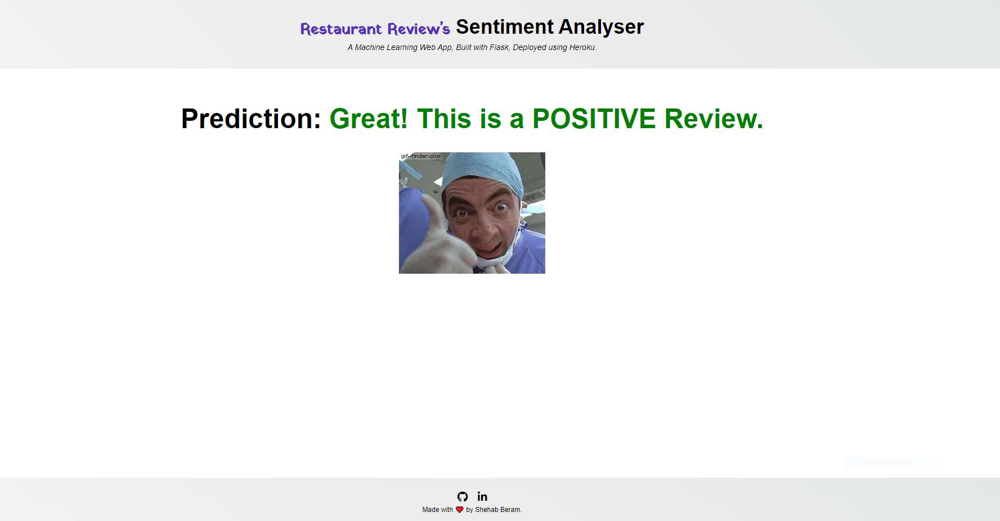

# Restaurant Review's Sentiment Analysis 

  

• A web application that utilizes machine learning and a dataset that consists of records from 1000 restaurants to classify if a newly entered review is positive or negative.

• A glimpse of the web app:

 

 

